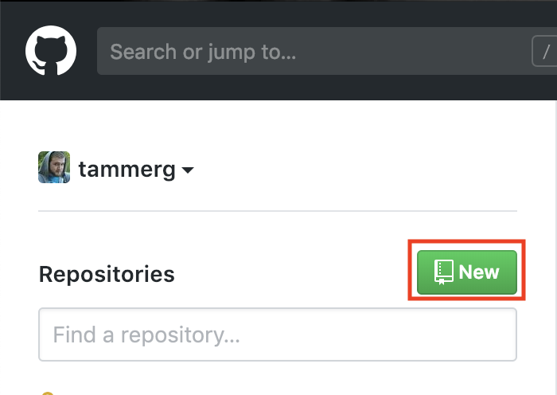

# How to connect a GitHub Repository to Heroku for Automatic Deployments

This short guide will take you through the steps of creating a repository, and then connecting your new repository to a Heroku application. This will allow for continuous deployment everytime you push the `master` branch of your GitHub repository!

**Note**: Please ensure your app functions properly locally with no errors. Fix any errors that are occurring or you can expect your application to not deploy.

## Create your GitHub Repository

First, we need to create a new GitHub repository.

1. Navigate to [GitHub](https://www.github.com) and sign into your account. 

2. On the left-side navbar, click the `New` button next to `Repositories`

3. Name your new repository and then click `Create repository`.

## Create New Heroku Application

Now that we have a GitHub repository, we need to create a new Heroku Application. We will do this via Heroku's website.

1. Navigate to [Heroku](https://www.heroku.com)

2. Login and on your dashboard click `New` and then in the dropdown click `Create new app`.

3. Next, name your new application and click `Create app`.

4. On the `Deploy` tab, click `GitHub` (connect to GitHub)

5. Next, click `Connect to GitHub`.

6. A modal will appear asking you to `Authorize Heroku` to access your GitHub. Click `Authorize Heroku`.

7. Now that you have authorized Heroku and given access to your GitHub. Use the search box to search for the repository you created earlier.

8. Finally, click `Connect` to the right of the repo you created earlier.

9. Scroll down to the `Automatic Deployment` section, and click `Enable Automatic Deployments`.

Now you are good to go! Whenever you are working on your project and you push to master via PR (You should never be pushing directly to master!) it will automatically push to Heroku, updating your live application!

* We have also created a video guide for you to follow along with if you need

[Connect GitHub to Heroku](https://youtu.be/GgNcs9zlFSA?list=PLOFmg4xbN_TPrB6w4rThsFanVxJI_SfER)

If you have any further questions or get stuck, please ask your TAs for assistance.
